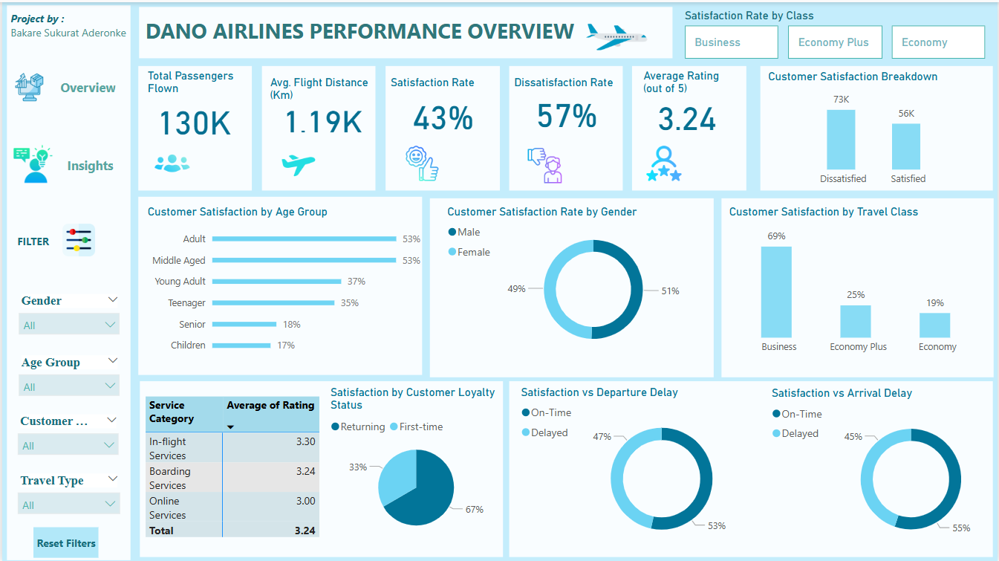
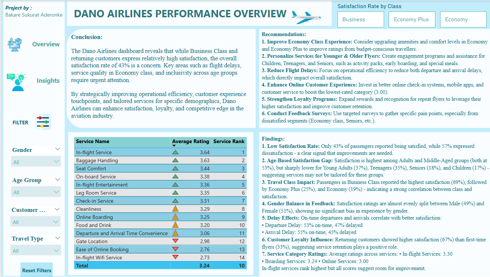

# Dano Airlines Performance Overview

## 📌 Project Description

This repository contains a **Power BI dashboard** analyzing the performance of **Dano Airlines**, with a focus on customer satisfaction, service quality, and operational efficiency. The report explores key factors impacting passenger satisfaction and provides data-driven recommendations to enhance service delivery.

---

## Key Insights

- **Satisfaction Rate:** 43% of passengers reported being satisfied, while 57% expressed dissatisfaction.
- **Travel Class Impact:** 
  - Business Class: 69% satisfaction
  - Economy Plus: 25% satisfaction
  - Economy: 19% satisfaction
- **Age Group Impact:** 
  - Adults and Middle-Aged passengers show the highest satisfaction (53% each).
  - Young Adults (37%), Teenagers (35%), Seniors (18%), and Children (17%) report much lower satisfaction.
- **Gender:** Satisfaction is nearly balanced between Male (51%) and Female (49%) passengers.
- **Flight Timeliness:** On-time departures and arrivals are associated with higher satisfaction.
- **Service Rankings:** 
  - Highest: In-flight Service (3.64), Baggage Handling (3.63)
  - Lowest: Online Services (3.00), In-flight Wifi (2.73)

---

## 🛠 Methodology

- **Power BI Modeling:** Data cleaned and transformed within Power BI.
- **Unpivoting:** 14 service-related columns were unpivoted into a single column to enable comprehensive service category analysis.
- **DAX Calculations:** Custom measures for satisfaction rates, class-wise breakdowns, age-group trends, delay impact, and service rankings.
- **Visuals:** Interactive filters for gender, age group, customer type, and travel type.

---

## 💡 Recommendations

- Upgrade amenities and comfort levels in **Economy** and **Economy Plus** classes.
- Personalize services for **younger** and **older** passengers.
- Reduce **departure** and **arrival delays** through improved operational efficiency.
- Enhance **online customer experience** (e.g. online check-in, booking systems).
- Strengthen **loyalty programs** to improve repeat customer satisfaction.
- Conduct targeted **feedback surveys** to identify and address specific pain points.

---

## 📷 Screenshots

### Dashboard Overview  

### Insights Page  

---

You can Explore the Dataset here

## 🏷️ Tags

`Power BI` `Airline Analytics` `Customer Satisfaction` `Data Visualization` `Business Intelligence` `Dashboard`
